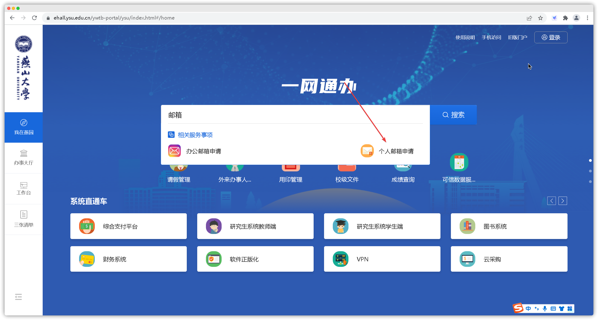
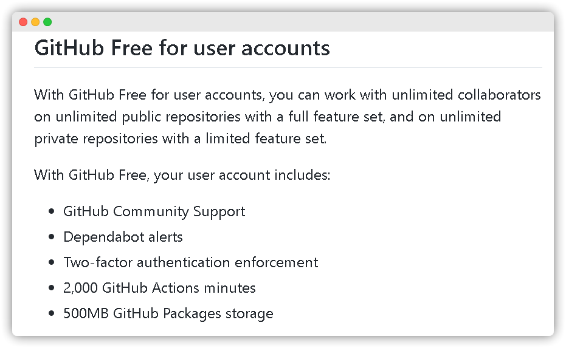

<!-- 
    author: ercao (vip@ercao.cn) 
-->

# 校园邮箱

---

校园邮箱说白了，就是”普通邮箱“，但其邮箱后缀以 edu.cn(中国学校) 结尾。
当然了既然有个修饰词`校园`，那肯定是有特别之处的，其中最重要的就是白嫖许多好东西。

比如说Office 365，这种东西相当于是学生必备工具了

特别是，对于计算机相关专业的同学来说还有更多实用的工具。比如大家所常知的Github(gayhub)、jetbrains全家桶。

---

## 申请校园邮箱

### 使用[一网通办](https://ehall.ysu.edu.cn/ywtb-portal/ysu/index.html#/home)办理(PC端)

1. 进入一网通办网站，搜索`个人邮箱办理`
  
    

2. 点击`发起申请`

    

3. 申请理由随便写(例如：申请教育优惠)、拟设邮箱随便写，不合法的随机分配

    

4. 然后等待几天就好

### 使用今日校园办理(手机端)

<!-- TODO: 今日校园申请 -->

## 配置校园邮箱

<!-- 配置校园邮箱 -->

## 可白嫖的工具

### [Office 365](https://www.microsoft.com/en-us/microsoft-365/)

申请流程：
进入官网，使用申请到的教育邮箱注册帐号，就好了。

> 这东西好像很鸡肋，只能浏览器使用？

### [GitHub](https://github.com/)(gayhub)

> 作为全球最大的git托管平台，而且基本上与编程相关的网站都可以关联Github帐号，可以说是非常非常的重要的了，至于为什么不放到第一位，只是因为他对计算机专业的而言，对其他专业嘛不好说

虽然Github 不使用校园邮箱也是可以用的，但是有了校园邮箱就能使用Pro版($4/month)，能白嫖，何乐而不为？[Free 与 Pro比较](https://docs.github.com/en/get-started/learning-about-github/githubs-products#github-free-for-user-accounts)

申请流程：

1. 进入[官网](https://education.github.com/discount_requests/student_application), 下拉填表
    **这里名字要写真实姓名**，为何使用Github：随便写

    > Github账户要先绑定校园邮箱帐号。这里要选择用教育邮箱申请。

    
    

2. ~~使用教育邮箱，发送你的学生凭证(当然也可以不发，无非就是申请的要慢一些罢了)~~

3. Github 会向你的邮箱中发送一封验证邮件，点击确认就好

这个应该能持续到你毕业，目前来看

### [Jetbrains 全家桶](https://www.jetbrains.com/)

jetbrains家的工具可以说是非常的好用，而且**特别的人性化，用高端一点的说法是叫符合人体工程学**。

> Jetbrains的学生认证需要每年都更新一次

<!--  TODO: jetbrains 申请流程 -->
申请流程：

### 其他工具

当然了能白嫖的东西肯定不会只有这么多啦，这三个只是我感觉相对来说比较重要的三个。

- [GitHub Student Developer Pack](<https://education.github.com/pack>)

  这个网站中的是能免费1-2年，几个月，也有免费到毕业
  而且大部分都可以使用 GitHub 直接学生认证

    
    

## 相关资源

- [邮件系统常见问题](https://yit.ysu.edu.cn/info/1036/1134.htm)
- [配置outlook等电子邮件收发软件](https://yit.ysu.edu.cn/info/1036/1135.htm)
- [电子邮件系统使用说明](https://yit.ysu.edu.cn/info/1036/1136.htm)
