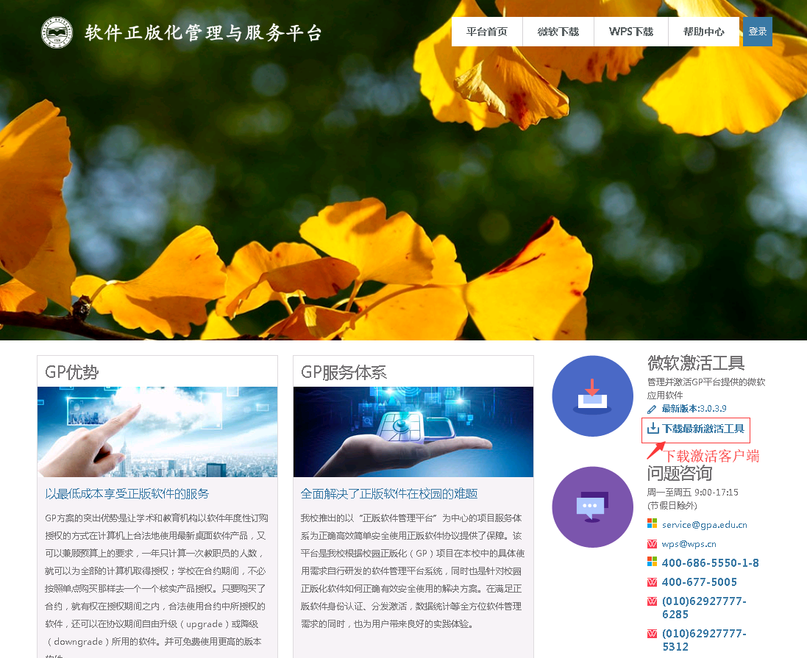
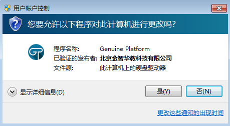
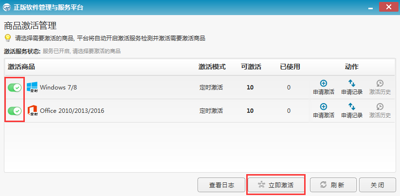

# Windows & Office 激活

::: tip

- 本页面提供的内容仅支持在本校正版化官网（ms.ysu.edu.cn）下载的 Microsoft 产品的激活，其他来源的 Microsoft 产品可能并不适用于本页面提供的激活方式。
- 本工具支持激活 office2016 及以后版本的 office 副本、Windows7 及以后版本的 Windows 副本。
- 本页面并不提供 Microsoft 产品的安装方式。

:::

## 准备工作

一个安装了 Windows 或 Office 等 Microsoft 产品的电脑、您的今日校园账号密码。

## 具体步骤

1. 在本校正版化官网（[ms.ysu.edu.cn](https://ms.ysu.edu.cn)）下载 GP 激活工具。**注意，请使用今日校园账号登录正版化官网。**

2. 下载完成后打开，点击“是”，进行安装，点击所有的下一步。

3. 安装完成后打开 GP 激活工具，使用今日校园账号登录。**注意，此操作必须联网且在校园网环境下进行，否则会无法登录。**

4. 找到你想激活的 Microsoft 产品，点击左侧的滑块，然后点击激活。**注意，如果使用的是非本校正版化官网下载的 Microsoft 产品，可能会出现产品无法在激活列表中显示、点击激活按钮后报错等情况。**
