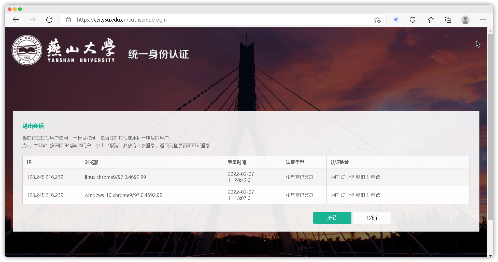

<!-- 
    author: ercao (vip@ercao.cn) 
-->

# 统一身份认证系统

## 简介

[统一身份认证系统](https://cer.ysu.edu.cn)是燕山大学的单点登录系统，其本身是为了**在多个应用系统中，只需要登录一次，就可以访问其他相互信任的应用系统**。进而对学生、教职工账号进行统一管理。

-- But，目前看来好像并没有什么卵用:eyes: (仅统计本科学生可用系统)

系统 | 账号管理系统
--- | ---
  [正方教务系统](http://202.206.243.62/) | 使用单独一套账号管理系统，不支持HTTPS
[实验与毕设系统](http://202.206.243.7/) | 使用单独的一套账号管理系统，不支持HTTPS（在与正方教务系统密码不相同的情况下，竟然可以直接通过正方教务系统获取到该系统的登录凭证，而且可以直接改密码:sweat_smile:）
[综合服务大厅](https://ehall.ysu.edu.cn/) | **使用统一身份认证系统**
[教学质量管理系统](https://ysu.mycospxk.com/) | 使用单独一套账号管理系统
[学生选课系统](https://xsxk.ysu.edu.cn/) | **仅使用统一身份认证系统的账号数据库**
[校园网认证服务](https://auth.ysu.edu.cn) | **仅使用统一身份认证系统的账号数据库**

## 登录界面

  

> 用户名：学工号/高考考生号
<!-- TODO(ercao)：初始密码 -->
> 初始密码：

# 后台界面

  

> :cowboy_hat_face:**注意登入系统后：一定要先绑定邮箱或手机号，避免忘记密码之后的麻烦。**

也可以绑定其他平台账号（QQ、微信） 字体竟然是白色的我干
  

为了安全考虑尽量将`单浏览器登录`与`密码变动提醒`开启
  

当开启单浏览器登录选项后，使用另一浏览器登录会出现以下情况
> 出现以下界面并非代表未登录，而是`成功登录但是无操作权限`
> 点击继续会关闭其他所有会话，点击取消为登出

  

# 忘记密码

若忘记密码请点击 `登录界面`的`忘记密码`超链接
  

找回方式：使用手机、邮箱找回都可
  

确认账户：按提示填入信息即可
  

安全认证：填入手机/邮箱接收到的验证码
  

重置密码：输入重置后的密码
  
