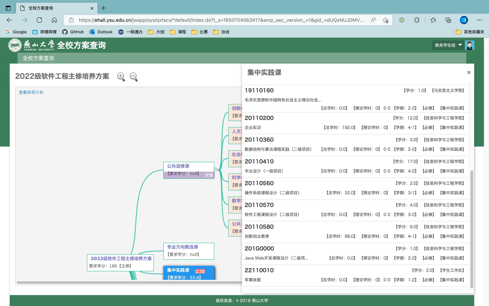
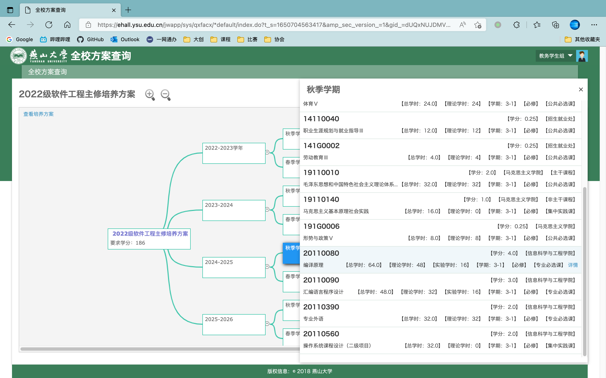

# 培养方案查询

通俗而言、培养方案给出一个专业下，学生应修课程的类型、课时、学分。
可以在这里查到某一学期应修课程、对应学分等学生较为关注的信息。

## 入口

登录-，搜索进入 `全校方案查询` 。

## 查询

在搜索栏中输入恰当的关键字、点击搜索即可。注意筛选培养方案中`年级` & `修读类型` 。

### 按类型查询

进入后，点击各个类型即可查看到相关信息。

### 按学年查询

单击页面左上角的 `查看指导计划` ，即可得到按学年分配的课程详情。

